# Monk Journey

## Overview

Monk Journey is an action RPG game where you play as a monk with powerful martial arts abilities. Navigate through procedurally generated terrains, defeat enemies, and master a variety of special skills to become the ultimate warrior monk.


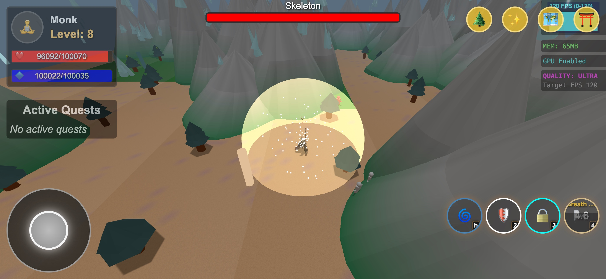


**Table of Content**

- [Monk Journey](#monk-journey)
  - [Overview](#overview)
  - [Features](#features)
  - [Gameplay](#gameplay)
  - [Development](#development)
  - [Google Play](#google-play)
  - [Credits](#credits)
  - [License](#license)

## Features

### 01. Combat

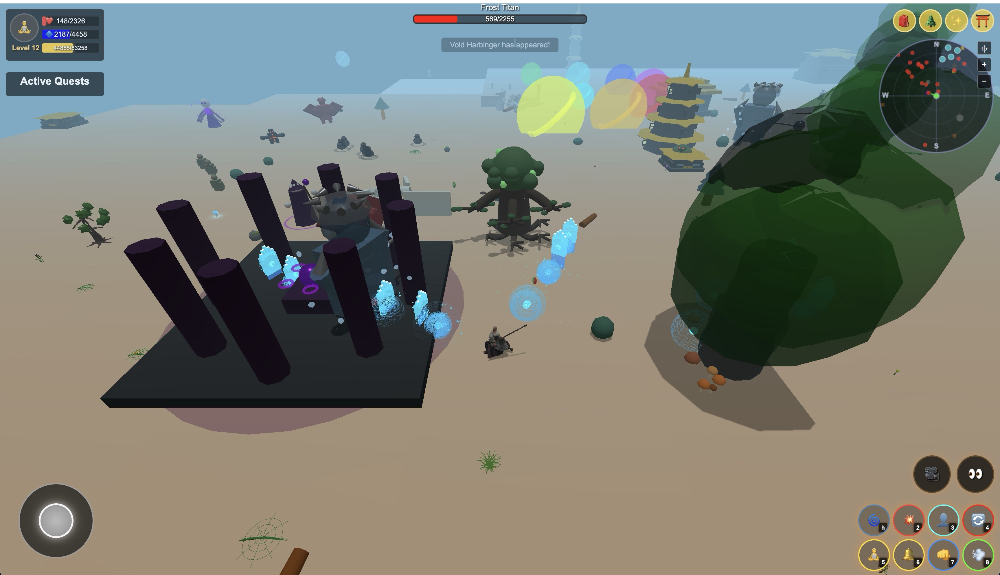
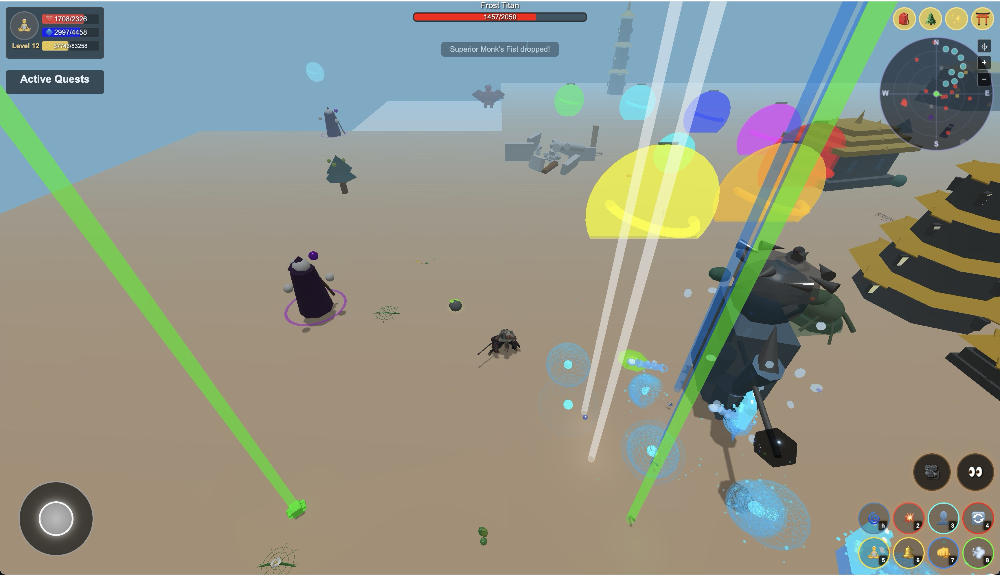
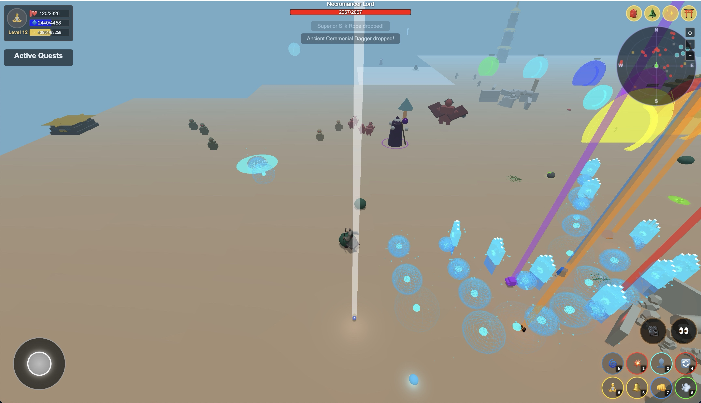

### 02. Fist Person View

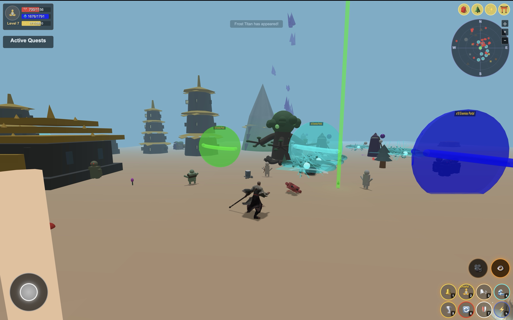
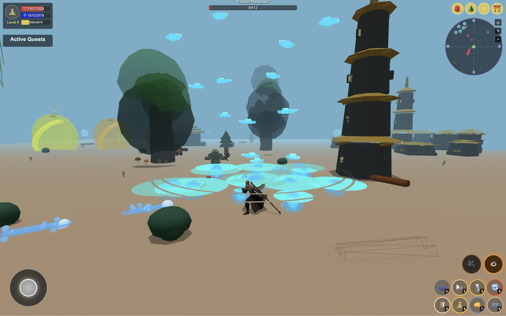
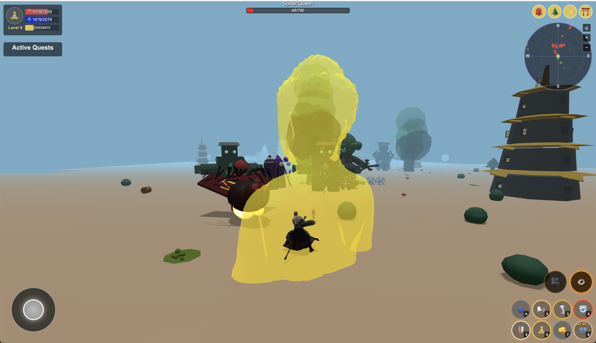
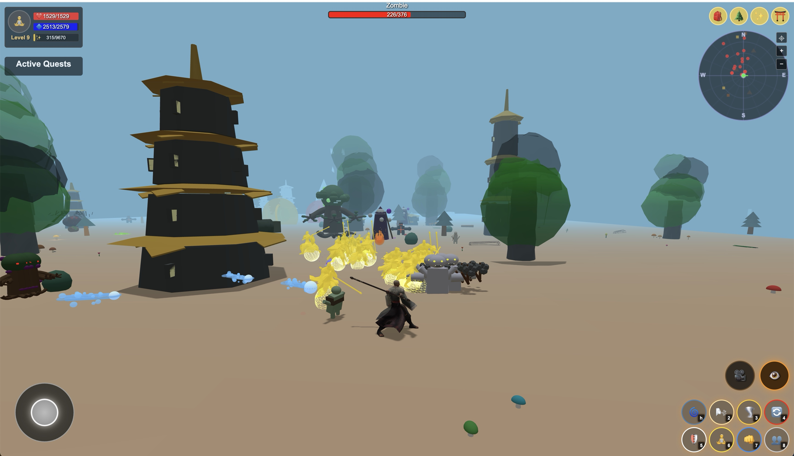

### 03. Skill Selection


### 04. Skill Tree


### 05. Inventory


### 06. Model Preview
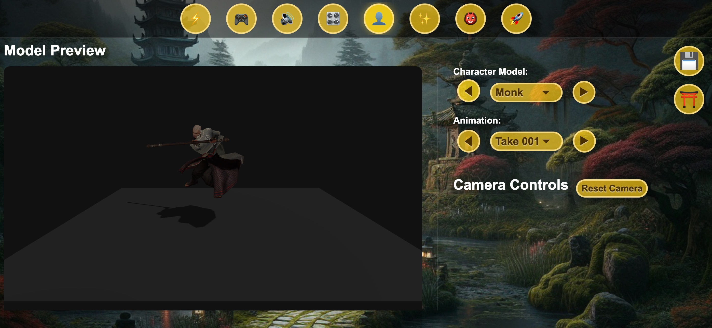

### 07. Skill Preview
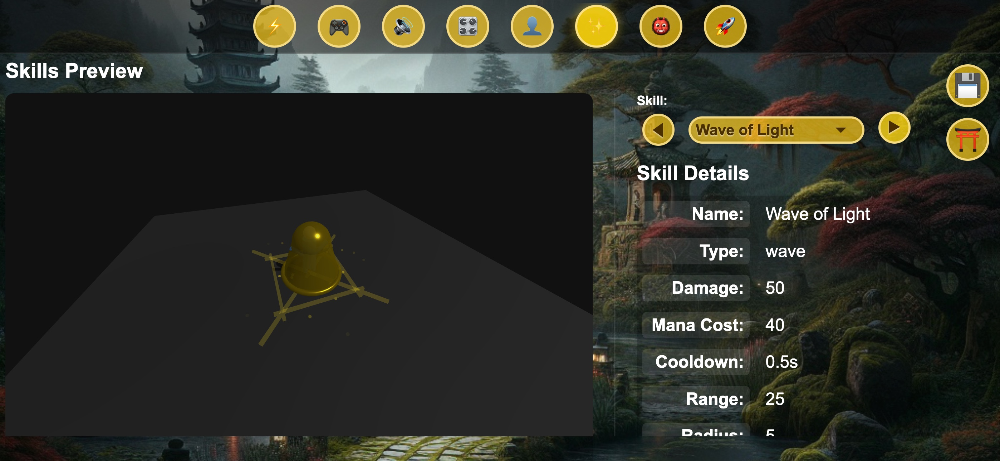

### 08. Enemy Preview
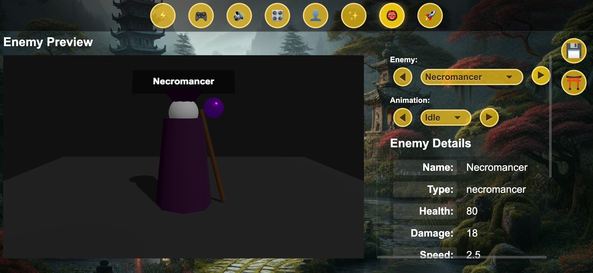

### 09. Orbit Control


### 10. Multi Player


## Gameplay

- **Powerful Monk Skills**: Master abilities like Wave Strike, Cyclone Strike, Seven-Sided Strike, and Inner Sanctuary
- **Procedurally Generated World**: Explore an endless, dynamically created landscape
- **Engaging Combat**: Fast-paced action with responsive controls
- **Character Progression**: Level up your monk and improve your abilities
- **Performance Optimization**: Adaptive quality settings for smooth gameplay on various devices

### Controls

- **WASD**: Move character
- **1-7**: Use skills

### Installation

1. Clone the repository
2. Open `index.html` in a modern web browser
3. No additional installation required - the game runs directly in your browser!

## Development

Monk Journey is built using:
- Three.js for 3D rendering
- JavaScript for game logic
- HTML5 and CSS for UI elements

### Pre-generating maps

From the **project root**, generate map JSON files for each zone style and a mixed-zone map. The Maps UI (top-right) loads the manifest from `maps/index.json` and each map from `maps/<id>.json` (relative paths work when the app is served from a subpath).

```bash
node scripts/generate-maps.js
```

This creates:
- `maps/default.json`, `maps/terrant.json`, `maps/forest.json`, `maps/desert.json`, `maps/mountains.json`, `maps/swamp.json`, `maps/magical.json`, `maps/mixed.json`
- `maps/index.json` — manifest (title, description, size, thumbnail path) for list and detail view

Optional: add thumbnail images under `maps/thumbnails/<id>.png` for each map.

## Google Play

[](https://play.google.com/store/apps/details?id=io.github.hoanganh25991.monkjourneyv49)


Get it on Google Play: https://play.google.com/store/apps/details?id=io.github.hoanganh25991.monkjourneyv49

### Short description (max 80 characters)

```
Action RPG. Play as a monk, master martial arts, and conquer endless terrain.
```
*Character count: 68*

### Long description (max 4000 characters)

```
Monk Journey is a premium action RPG where you become a warrior monk. Battle through procedurally generated worlds, unlock powerful skills, and grow stronger with every fight.

FIGHT AS A MONK
• Control a monk with fast, satisfying martial arts combat
• Use skills like Wave Strike, Cyclone Strike, Seven-Sided Strike, and Inner Sanctuary
• Face varied enemies and clear the land of darkness

EXPLORE & PROGRESS
• Endless procedurally generated terrain to explore
• Level up and improve your abilities
• Collect gear and manage your inventory

SMOOTH & ACCESSIBLE
• Optimized for a range of devices
• Adjustable quality and controls
• Fullscreen landscape gameplay

Download Monk Journey and start your journey today.
```

## Credits

Developed with passion by the Monk Journey team.

## License

Copyright © 2025 Monk Journey Team. All Rights Reserved.

This project is proprietary and confidential. Unauthorized reproduction, distribution, or disclosure is prohibited. No license, express or implied, to any intellectual property rights is granted by this document.

See the [LICENSE](LICENSE) file for full details.
